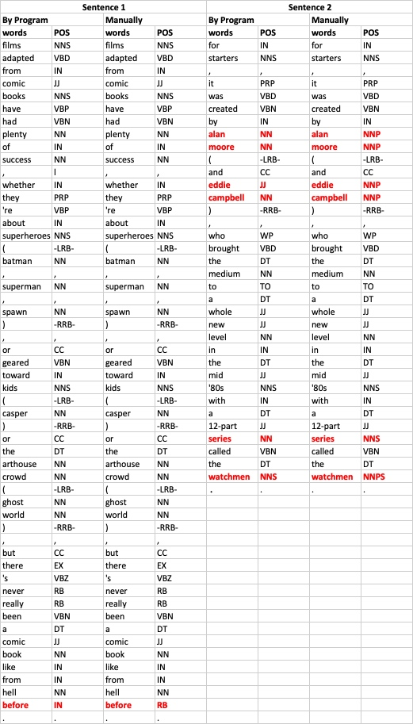

```{r setup, include=FALSE}
knitr::opts_chunk$set(echo = TRUE)
```

## Goal

To learn how to perform different annotations (word, sentence, part-of-speech) over text documents.

## Tasks
Annotate corpus:

- Add word, sentence and part-of-speech annotations
- Evaluate whether the POS annotation is correct
1. Perform the evaluation manually
2. Only the two first sentences of a document in the corpus
3. Only take into account complete and proper sentences
4. Use the precision and recall metrics


## Process

With the help of the [code provided by professors](https://rpubs.com/rgcmme/IS-HO2), I could easily add word, sentence and part-of-speech annotations.

### Setwd and load library
First, I set the work direction and load the required library. Please notice that package "openNLPmodels.en" is not available in R v3.5.1, so we have to go to the website to download this package to our local source and install it.
```{r message=FALSE, warning=FALSE, include=FALSE}
setwd('/users/mingjie/desktop/UPM/intelligent systems/Unit 4/R')
# Needed for OutOfMemoryError: Java heap space 
library(rJava)
.jinit(parameters="-Xmx4g")
# If there are more memory problems, invoke gc() after the POS tagging

# The openNLPmodels.en library is not in CRAN; it has to be installed from another repository
#install.packages("openNLPmodels.en", repos = "http://datacube.wu.ac.at")

library(NLP)
library(openNLP)
library(openNLPmodels.en)
library(tm)
```

### Define Auxiliary Functions
Second, we define some auxiliary functions which help us annotate in the following sections.

```{r include=FALSE}
# getAnnotationsFromDocument returns annotations for the text document: word, sentence, part-of-speech, and Penn Treebank parse annotations.
getAnnotationsFromDocument = function(doc){
  x=as.String(doc)
  sent_token_annotator <- Maxent_Sent_Token_Annotator()
  word_token_annotator <- Maxent_Word_Token_Annotator()
  pos_tag_annotator <- Maxent_POS_Tag_Annotator()
  y1 <- annotate(x, list(sent_token_annotator, word_token_annotator))
  y2 <- annotate(x, pos_tag_annotator, y1)
  parse_annotator <- Parse_Annotator()
  y3 <- annotate(x, parse_annotator, y2)
  return(y3)  
} 


# getAnnotatedMergedDocument returns the text document merged with the annotations.
getAnnotatedMergedDocument = function(doc,annotations){
  x=as.String(doc)
  y2w <- subset(annotations, type == "word")
  tags <- sapply(y2w$features, '[[', "POS")
  r1 <- sprintf("%s/%s", x[y2w], tags)
  r2 <- paste(r1, collapse = " ")
  return(r2)  
} 

# getAnnotatedPlainTextDocument returns the text document along with its annotations in an AnnotatedPlainTextDocument.
getAnnotatedPlainTextDocument = function(doc,annotations){
  x=as.String(doc)
  a = AnnotatedPlainTextDocument(x,annotations)
  return(a)  
} 
```

### Add word, sentence and part-of-speech annotations

Then, I loaded the corpus file and chose the first 10 corpus as analysed targets.
```{r include=FALSE}
source.pos = DirSource("./review_polarity/txt_sentoken/pos", encoding = "UTF-8")
corpus_all = Corpus(source.pos)
# Let'see the first 10 corpus.
corpus=corpus_all[0:10]
inspect(corpus[[1]])
```


getAnnotationsFromDocument returns annotations for the text document: word, sentence, part-of-speech, and Penn Treebank parse annotations.

The first several annotations are sentence annotations.
```{r}
annotations = lapply(corpus, getAnnotationsFromDocument)
# The first annotations are sentence annotations
head(annotations[[1]])
```

Word annotations also are defined. They indicate where the word starts, where it ends, and the part-of-speech tag.
```{r}
# Word annotations also are defined. They indicate where the word starts, where it ends, and the part-of-speech tag.
tail(annotations[[1]])
```

Use annotatedPlainTextDocument() to attach the annotations to the document and store the annotated corpus in another variable.
```{r include=FALSE}
# create AnnotatedPlainTextDocuments that attach the annotations to the document and store the annotated corpus in another variable 
corpus.tagged = Map(getAnnotatedPlainTextDocument, corpus, annotations)
corpus.tagged[[1]] 
head(corpus.tagged[[1]],2)
```

Store all the annotations inline with the text and store the annotated corpus in another variable (since we destroy the corpus metadata).
```{R include=FALSE}
# store all the annotations inline with the text and store the annotated corpus in another variable (since we destroy the corpus metadata).
corpus.taggedText = Map(getAnnotatedMergedDocument, corpus, annotations)
corpus.taggedText[[1]] 
```

### Access annotated documents
We could access annotated documents by using different functions showed below:

```{r include=FALSE}
doc = corpus.tagged[[1]] 
# For accessing the text representation of the document.
as.character(doc)
```

```{r}
# For accessing its words.
head(words(doc))
```

```{r}
# For accessing its sentences.
head(sents(doc),3)
```

```{r}
# For accessing its tagged words.
head(tagged_words(doc))
```

```{r}
# For accessing its tagged sentences.
head(tagged_sents(doc),3)
```

```{r}
# For accessing the parse trees of its sentences.
head(parsed_sents(doc),3)
```

## Evaluate the POS annotation manually

Let's see evaluate the POS annotation manually in the first two sentences in the first corpus.
```{r}
inspect(corpus_all[1])
```

We could get the first two sentences here:
1. films adapted from comic books have had plenty of success , whether they're about superheroes ( batman , superman , spawn ) , or geared toward kids ( casper ) or the arthouse crowd ( ghost world ) , but there's never really been a comic book like from hell before . 
2. for starters , it was created by alan moore ( and eddie campbell ) , who brought the medium to a whole new level in the mid '80s with a 12-part series called the watchmen .

We have known the tagged part-of-speech annotations defined by program and we could access by `head(tagged_sents(doc),2)`.

```{r}
head(tagged_sents(doc),2)
```
In order to check the precision and recall, I perform the evaluation manually to these two sentences with the Penn Treebank Tagset. The result is showed in the table. The difference between VB and VBP is maninly dependent on their roles in sentences detailed in [this  page](https://sites.google.com/site/partofspeechhelp/home#TOC-VB). 


We suppose the result mannually is right and the differences between these two version of results are showed in red in Table 1. In sentence 1, there is only one mismatch: "before"; In sentence 2, there are six mismatches: "alan", "moore", "eddie", "campbell", "series" and "watchmen". Obviously, five of six matches are proper nouns: two names of people and one book's. So we think this program can annotate well with the POS except proper nouns.

The precision in the two sentence is calculate by:
$$precision=\frac{number\ of\ correct\ tokens\ given\ by\ the\ system}{total\ number\ of\ tokens\ given\ by\ the\ system}=\frac{53+29}{54+35}=0.9213$$

The result is good. In this case, we chose the first 10 corpus, so the total numberof actual tokens in the text is the wordcount of these 10 corpus calculated by this snippet:
```{r}
all_doc=corpus.tagged
word_length=0
for (doc_i in all_doc){
  word_length=word_length+length(words(doc_i))
}
word_length
```

Therefore, the recall is:
$$recall=\frac{number\ of\ correct\ tokens\ given\ by\ the\ system}{total\ number\ of\ actual\ tokens\ in\ the\ text}=\frac{82}{7455}=0.0110$$

